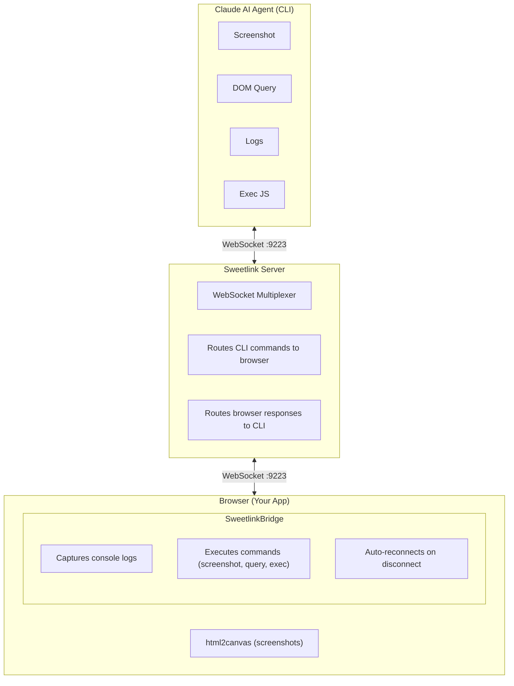

# @ytspar/sweetlink

[](https://www.npmjs.com/package/@ytspar/sweetlink)

> Autonomous development toolkit for Claude AI agents - screenshots, DOM queries, console logs, and JavaScript execution via WebSocket and Chrome DevTools Protocol

## Overview

Sweetlink enables Claude AI agents to autonomously debug, test, and iterate on web applications through real-time browser interaction. It provides a WebSocket bridge between your development server and CLI tools, allowing AI assistants to take screenshots, inspect DOM, capture console logs, and execute JavaScript - all without human intervention.

**Inspired by**: [Peter Steinberger's autonomous debugging implementation](https://x.com/steipete/status/1981998733736001727) - "Now my agent can debug everything completely autonomous e2e."

## Features

- **📸 Screenshots** - Capture full page or element-specific screenshots (html2canvas + CDP)
- **🖱️ Screenshot Button** - One-click screenshot capture with console logs from browser UI
- **🔍 DOM Queries** - Query and inspect DOM elements with CSS selectors
- **📊 Console Logs** - Capture and filter browser console output with JSON/summary formats
- **⚡ JavaScript Execution** - Run arbitrary JavaScript in browser context
- **🖱️ Click Elements** - Click elements by selector, text content, or both
- **🌐 Network Inspection** - Monitor network requests (CDP only)
- **🔄 Page Refresh** - Soft or hard refresh the browser from CLI
- **🔄 Auto Reconnection** - Browser client automatically reconnects on disconnect
- **🎯 Token Efficient** - ~1000 tokens/screenshot vs ~5000 for MCP tools
- **📝 LLM-Optimized Output** - Summary format with deduplication for context efficiency
- **🚀 Zero Setup** - Works immediately with any web app
- **🖥️ Persistent Daemon** - Playwright daemon stays alive between commands (~150ms screenshots)
- **🏷️ @Ref System** - Accessibility tree refs for click/fill without CSS selectors
- **📊 Ring Buffers** - Always-on console/network/dialog capture (50K entries)
- **🎬 Session Recording** - Record actions with screenshots, generate interactive viewer
- **🔍 Snapshot Diffing** - Text diff of accessibility tree after actions
- **📱 Device Emulation** - Named presets (iPhone 14, Pixel 7, iPad Pro) for batch screenshots

## Screenshot Button

The browser UI includes a convenient screenshot button (📸) that allows developers and AI agents to instantly capture the current page state along with console logs. When clicked:

1. **Captures full page screenshot** using html2canvas
2. **Saves screenshot** to `.tmp/sweetlink-screenshots/screenshot-[timestamp].png`
3. **Saves console logs** to `.tmp/sweetlink-screenshots/screenshot-[timestamp]-logs.txt`
4. **Logs include**: timestamp, URL, dimensions, and all console messages

This provides AI agents with easy access to visual state and debugging information without requiring CLI commands.

**File Location Rationale**: Files are saved to `.tmp/sweetlink-screenshots/` (relative to project root) for easy agent access - keeps screenshots with the project and is typically gitignored via `.tmp/` patterns.

## Requirements

This package is **ESM-only**. It requires `"type": "module"` in your `package.json` or an ESM-capable bundler (Vite, webpack, esbuild, etc.).

## Installation

```bash
npm install @ytspar/sweetlink
# or
pnpm add @ytspar/sweetlink
# or
yarn add @ytspar/sweetlink

# Install canary (latest from main)
pnpm add @ytspar/sweetlink@canary
```

### Claude Code Integration

If you use [Claude Code](https://claude.com/claude-code), run the setup command to install the screenshot skill and context files:

```bash
pnpm sweetlink setup
```

This creates symlinks in your `.claude/` directory so Claude can use the `/screenshot` skill automatically. Re-run after upgrading sweetlink to pick up any skill updates.

## Quick Start

### For Vite Apps (Recommended)

Just add the plugin - zero configuration needed:

```typescript
// vite.config.ts
import { defineConfig } from 'vite';
import { sweetlink } from '@ytspar/sweetlink/vite';

export default defineConfig({
  plugins: [sweetlink()]
});
```

That's it! The plugin automatically:
- Starts the Sweetlink server when Vite starts
- Detects Vite's port and configures everything
- DevBar connects automatically

### For Next.js (Recommended)

Wrap your Next.js config - zero configuration needed:

```javascript
// next.config.mjs
import { withSweetlink } from '@ytspar/sweetlink/next';

const nextConfig = { /* your config */ };
export default withSweetlink(nextConfig);
```

That's it! The plugin automatically:
- Detects the port from `--port` argv (e.g., `next dev --port 3002`)
- Falls back to `process.env.PORT`, then `3000`
- Starts the WebSocket server on `appPort + 6223`
- No-ops in production

Works with other wrappers too:

```javascript
// With Sentry, MDX, etc.
export default withSentryConfig(withSweetlink(withMDX(nextConfig)), sentryOptions);
```

### For Any Node.js App (Express, Remix, etc.)

Add one line at the top of your server file:

```typescript
// server.ts, app.ts, or entry point
import '@ytspar/sweetlink/auto';

// Your app code...
```

This automatically:
- Starts Sweetlink in development mode only
- Reads port from `process.env.PORT` (or defaults to 3000)
- DevBar connects automatically

#### With Explicit Configuration

```typescript
import { startSweetlink } from '@ytspar/sweetlink/auto';

startSweetlink({ appPort: 3000 });
```

### Using DevBar (Browser UI)

Add DevBar to your app for the screenshot button and dev toolbar:

```typescript
// app/root.tsx, _app.tsx, or App.tsx
import { initGlobalDevBar } from '@ytspar/devbar';

if (process.env.NODE_ENV === 'development') {
  initGlobalDevBar();
}
```

DevBar automatically connects to Sweetlink - no configuration needed.

### CLI Usage

Add to your package.json for CLI access:

```json
{
  "scripts": {
    "sweetlink": "sweetlink"
  }
}
```

Then use:

```bash
pnpm sweetlink screenshot
pnpm sweetlink logs
pnpm sweetlink query --selector "h1"
```

## CLI Usage

### Screenshots

```bash
# Full page screenshot (html2canvas, fast)
pnpm sweetlink screenshot

# Element screenshot
pnpm sweetlink screenshot --selector ".company-card"

# Full page with custom output
pnpm sweetlink screenshot --full-page --output page.png

# Navigate to URL before capturing
pnpm sweetlink screenshot --url http://localhost:3000/about

# Custom viewport dimensions
pnpm sweetlink screenshot --force-cdp --width 375 --height 667
pnpm sweetlink screenshot --force-cdp --viewport mobile

# Pixel-perfect via daemon (see Persistent Daemon section)
pnpm sweetlink screenshot --hifi
pnpm sweetlink screenshot --responsive

# Skip server readiness check
pnpm sweetlink screenshot --no-wait

# Force specific method
pnpm sweetlink screenshot --force-cdp   # Playwright/CDP
pnpm sweetlink screenshot --force-ws    # WebSocket/html2canvas
```

### DOM Queries

```bash
# Query elements
pnpm sweetlink query --selector "h1"

# Get element property
pnpm sweetlink query --selector ".card" --property "offsetWidth"

# Wait for element to exist before querying (handles hydration)
pnpm sweetlink query --selector "img" --wait-for "img[src*='hero']"
```

### Console Logs

```bash
# Get all logs
pnpm sweetlink logs

# Filter by error
pnpm sweetlink logs --filter "error"

# JSON output (full array)
pnpm sweetlink logs --format json

# LLM-optimized summary (deduplicated, sorted by severity)
pnpm sweetlink logs --format summary

# Text format with deduplication
pnpm sweetlink logs --dedupe
```

#### Log Output Formats

| Format | Description | Best For |
|--------|-------------|----------|
| `text` (default) | Human-readable timestamped lines | Manual debugging |
| `json` | Full JSON array with all entries | Programmatic access |
| `summary` | Compact JSON with deduplication | LLM context optimization |

**Summary format example:**
```json
{
  "url": "http://localhost:3000",
  "capturedAt": "2025-01-27T...",
  "totalLogs": 47,
  "uniqueLogs": 3,
  "byLevel": { "error": 2, "warn": 0, "log": 1 },
  "logs": [
    { "level": "error", "message": "...", "count": 25 },
    { "level": "log", "message": "...", "count": 22 }
  ]
}
```

### Page Refresh

```bash
# Soft refresh (reload page)
pnpm sweetlink refresh

# Hard refresh (clear cache and reload)
pnpm sweetlink refresh --hard
```

### JavaScript Execution

```bash
# Execute JavaScript expression
pnpm sweetlink exec --code "document.title"

# Count elements
pnpm sweetlink exec --code "document.querySelectorAll('.card').length"

# Bare return statements are auto-wrapped in an IIFE
pnpm sweetlink exec --code "const x = 1 + 2; return x;"

# Promises are automatically awaited (10s timeout)
pnpm sweetlink exec --code "fetch('/api/health').then(r => r.status)"

# Wait for element to exist before executing
pnpm sweetlink exec --code "document.querySelectorAll('img').length" --wait-for "img[src*='hero']"
```

> **Framework hydration note**: With Next.js App Router, Vite, and other frameworks that hydrate incrementally, DOM elements may exist in the HTML but not be queryable immediately after page load. Use `--wait-for` to poll until the target element is present.

### Click Elements

```bash
# Click by CSS selector
pnpm sweetlink click --selector "button.submit"

# Click by text content
pnpm sweetlink click --text "Submit"

# Combine selector + text for precise matching
pnpm sweetlink click --selector "th" --text "Rank"
pnpm sweetlink click --selector "a" --text "BACK TO LIST"

# Select nth match (0-based index)
pnpm sweetlink click --selector ".tab" --index 2
```

**Options:**
| Option | Description |
|--------|-------------|
| `--selector` | CSS selector to find elements |
| `--text` | Find element by text content |
| `--index` | Select nth match when multiple found (default: 0) |

**Debugging:** Use `DEBUG=1 pnpm sweetlink click ...` to see generated JavaScript.

### Network Requests

```bash
# Get all network requests (via WebSocket bridge)
pnpm sweetlink network

# Filter by URL
pnpm sweetlink network --filter "/api/"

# Failed requests only (via daemon ring buffer)
pnpm sweetlink network --failed
pnpm sweetlink network --failed --last 10
```

### Schema, Outline, Accessibility

```bash
# Page schema (JSON-LD, meta tags, Open Graph)
pnpm sweetlink schema

# Document outline (heading structure)
pnpm sweetlink outline

# Accessibility audit (axe-core)
pnpm sweetlink a11y

# Web Vitals (FCP, LCP, CLS, INP)
pnpm sweetlink vitals
```

### Server Management

```bash
# Wait for dev server to be ready (useful in scripts)
pnpm sweetlink wait --url http://localhost:3000
pnpm sweetlink wait --url http://localhost:3000 --wait-timeout 60000

# Check server health
pnpm sweetlink status

# Clean up Sweetlink processes
pnpm sweetlink cleanup
pnpm sweetlink cleanup --force

# Target specific app in monorepo (by branch or app name)
pnpm sweetlink screenshot --app my-app
```

### Persistent Daemon (v2)

Sweetlink v2 adds a persistent Playwright daemon for high-fidelity operations. The daemon auto-starts on first use and auto-stops after 30min idle.

#### Auto-Start with Vite

Add `daemon: true` to your Vite plugin config — the daemon starts/stops with your dev server:

```typescript
// vite.config.ts
import { sweetlink } from '@ytspar/sweetlink/vite';

export default defineConfig({
  plugins: [sweetlink({ daemon: true })]
  // Or with visible browser: sweetlink({ daemon: true, headed: true })
});
```

#### Auto-Start with Dev Script

Add a `dev` script that starts both your app and the daemon:

```json
{
  "scripts": {
    "dev": "vite",
    "dev:daemon": "concurrently 'vite' 'sweetlink daemon start --url http://localhost:5173'"
  }
}
```

#### Multiple Apps (Monorepo)

Each daemon is scoped by app port. Running two apps on different ports creates separate daemons:

```bash
# Terminal 1: App A on port 3000
sweetlink daemon start --url http://localhost:3000
# State: .sweetlink/daemon-3000.json

# Terminal 2: App B on port 5173
sweetlink daemon start --url http://localhost:5173
# State: .sweetlink/daemon-5173.json

# Commands target specific apps via --url
sweetlink screenshot --hifi --url http://localhost:3000
sweetlink screenshot --hifi --url http://localhost:5173
```

#### Manual Lifecycle

```bash
# Start manually (auto-starts on first --hifi command if not running)
pnpm sweetlink daemon start --url http://localhost:5173
pnpm sweetlink daemon start --url http://localhost:5173 --headed  # visible browser

# Check status
pnpm sweetlink daemon status

# Stop (or wait for 30min idle auto-stop)
pnpm sweetlink daemon stop
```

#### CLI Quick Reference

```bash
# Pixel-perfect screenshot via persistent daemon (~150ms after startup)
pnpm sweetlink screenshot --hifi

# Responsive screenshots at 3 breakpoints (375/768/1280)
pnpm sweetlink screenshot --responsive
```

### Accessibility Snapshots & Refs

```bash
# List interactive elements with @refs
pnpm sweetlink snapshot -i
#   @e1 [link] "Home"
#   @e2 [button] "Submit"
#   @e3 [textbox] "Email"

# Click/fill by ref (no CSS selector needed)
pnpm sweetlink click @e2
pnpm sweetlink fill @e3 "user@example.com"

# Diff against previous snapshot
pnpm sweetlink snapshot -D

# Annotated screenshot with red ref labels
pnpm sweetlink snapshot -a -o annotated.png
```

### Console & Network (Ring Buffers)

Always-on capture from daemon start — no "start watching" needed.

```bash
# Console messages (captured since daemon start)
pnpm sweetlink console
pnpm sweetlink console --errors
pnpm sweetlink console --last 20

# Failed network requests
pnpm sweetlink network --failed
```

### Session Recording

```bash
pnpm sweetlink record start
# ... do actions (click, fill, snapshot) ...
pnpm sweetlink record stop
# Generates .sweetlink/<session-id>/viewer.html
```

### Demo Documents

Build a Markdown tutorial/proof document step-by-step (inspired by [Showboat](https://simonwillison.net/2026/Feb/10/showboat-and-rodney/)):

```bash
# Start a new demo
pnpm sweetlink demo init "How to use the search feature"

# Add narrative prose
pnpm sweetlink demo note "First, run the tests to see them pass."

# Run a command and capture output inline
pnpm sweetlink demo exec "pnpm test -- --grep search"

# Take a screenshot and embed it
pnpm sweetlink demo screenshot --url http://localhost:5173 --caption "Search results"

# Capture accessibility tree
pnpm sweetlink demo snapshot --url http://localhost:5173

# Remove last section if it's wrong
pnpm sweetlink demo pop

# Re-run all commands to verify outputs haven't changed
pnpm sweetlink demo verify

# Check status
pnpm sweetlink demo status
```

Result: a `DEMO.md` with embedded command outputs and screenshots that serves as both documentation and a regression test.

### PR Evidence

```bash
pnpm sweetlink proof --pr 123
```

## Chrome DevTools Protocol (CDP) Setup

For native Chrome rendering and network inspection:

```bash
# macOS
/Applications/Google\ Chrome.app/Contents/MacOS/Google\ Chrome --remote-debugging-port=9222

# Linux
google-chrome --remote-debugging-port=9222

# Windows
"C:\Program Files\Google\Chrome\Application\chrome.exe" --remote-debugging-port=9222
```

Set environment variable (optional):

```bash
export CHROME_CDP_PORT=9222
```

## Programmatic API

### Server

```typescript
import { initSweetlink, closeSweetlink } from '@ytspar/sweetlink/server';

// Start server
const wss = await initSweetlink({ port: 9223 });

// Close server
await closeSweetlink();
```

### CDP Integration

```typescript
import {
  detectCDP,
  getCDPBrowser,
  screenshotViaCDP,
  getNetworkRequestsViaCDP
} from '@ytspar/sweetlink/cdp';

// Check if CDP is available
const hasCDP = await detectCDP();

// Take screenshot via CDP
const result = await screenshotViaCDP({
  output: 'screenshot.png',
  fullPage: true
});

// Get network requests
const requests = await getNetworkRequestsViaCDP({
  filter: '/api/'
});
```

### Browser Bridge (Vanilla JS)

The browser bridge is a vanilla JS class (not a React component). For most setups, use the Vite plugin or auto-import instead of initializing manually.

```typescript
import { initSweetlinkBridge } from '@ytspar/sweetlink/browser';

// Initialize with defaults (auto-detects port from devbar)
initSweetlinkBridge();

// Or with explicit config
initSweetlinkBridge({
  basePort: 9223,
  debug: true,
});
```

#### SweetlinkBridgeConfig

| Option | Type | Default | Description |
|--------|------|---------|-------------|
| `basePort` | `number` | Auto-detected | WebSocket server port |
| `maxPortRetries` | `number` | `10` | Max port scan attempts |
| `hmrScreenshots` | `boolean` | `false` | Auto-capture on HMR updates |
| `debug` | `boolean` | `false` | Enable verbose connection logging |

## Environment Variables

| Variable | Default | Description |
|----------|---------|-------------|
| `SWEETLINK_WS_PORT` | `9223` | WebSocket server port |
| `SWEETLINK_WS_URL` | `ws://localhost:9223` | WebSocket URL (CLI) |
| `CHROME_CDP_PORT` | `9222` | Chrome DevTools Protocol port |
| `CHROME_CDP_URL` | `http://127.0.0.1:9222` | CDP URL |

## Architecture



## Use Cases

### Autonomous UI Development

```typescript
while (!designPerfect) {
  // Make UI changes
  await editComponent();

  // Take screenshot
  await exec('pnpm sweetlink screenshot --selector ".component"');

  // Check for console errors
  const logs = await exec('pnpm sweetlink logs --filter error');

  // Iterate until perfect!
}
```

### Automated Testing

```bash
# Take baseline screenshot
pnpm sweetlink screenshot --output baseline.png

# Make changes...

# Take comparison screenshot
pnpm sweetlink screenshot --output comparison.png

# Compare screenshots with image diff tool
```

### Debugging Production Issues

```bash
# Get console errors
pnpm sweetlink logs --filter error

# Inspect element state
pnpm sweetlink query --selector ".error-component"

# Execute debug code
pnpm sweetlink exec --code "localStorage.getItem('debug')"
```

## Token Efficiency

Sweetlink is designed for token-efficient autonomous loops:

- **html2canvas screenshots**: ~131KB (~1,000 tokens)
- **CDP screenshots**: ~2.0MB (~15,000 tokens)
- **Default strategy**: Use html2canvas first, escalate to CDP only when needed

This 15x token savings enables 10+ autonomous iterations within Claude's budget.

## Comparison with Alternatives

| Feature | Sweetlink | Playwright MCP | Manual Screenshots |
|---------|-----------|----------------|-------------------|
| Setup Time | < 1 min | 5-10 min | N/A |
| Token Cost | ~1,000 | ~5,000 | N/A |
| Auto Reconnect | ✅ | ❌ | N/A |
| Console Logs | ✅ | ✅ | ❌ |
| Network Requests | ✅ (CDP) | ✅ | ❌ |
| DOM Queries | ✅ | ✅ | ❌ |
| JS Execution | ✅ | ✅ | ❌ |
| Click Elements | ✅ | ✅ | ❌ |
| Element Screenshots | ✅ | ✅ | ❌ |
| Full Page Screenshots | ✅ | ✅ | ✅ |
| Autonomous Loops | ✅ (10+) | Limited (2-3) | ❌ |

## When to Use Alternatives

### Sweetlink vs Agent Browser vs Playwright

**Use Sweetlink when:**
- You're debugging/iterating on a running dev server
- You need lightweight, token-efficient screenshots (~1000 tokens vs ~5000)
- You want real-time console log capture
- Your app is already running and you just need to inspect it
- You're doing autonomous UI development loops (10+ iterations)

**Use [Agent Browser](https://github.com/vercel-labs/agent-browser) when:**
- You need full browser automation (navigation, form filling, multi-page flows)
- You're testing production sites or external URLs
- Sweetlink isn't integrated into the target application
- You need Stagehand's AI-powered element selection
- You're building autonomous agents that interact with arbitrary websites

**Use Playwright MCP when:**
- You need precise, programmatic browser control
- You're running E2E tests with assertions
- You need browser contexts, multiple tabs, or complex scenarios
- You require network interception or request mocking

### Agent Browser Quick Start

Agent Browser is Vercel's Stagehand-based browser automation tool. It's ideal as a Sweetlink backup for scenarios requiring full browser control.

```bash
# Install globally
npm install -g @anthropic-ai/agent-browser

# Or use npx
npx @anthropic-ai/agent-browser
```

**Basic usage with Claude:**

```bash
# Take screenshot of any URL
agent-browser screenshot https://example.com

# Navigate and interact
agent-browser navigate https://example.com
agent-browser click "Sign In"
agent-browser type "username" --into "Email field"

# Extract page content
agent-browser extract "main article content"
```

**Key differences from Sweetlink:**

| Aspect | Sweetlink | Agent Browser |
|--------|-----------|---------------|
| Setup | Requires app integration | Works with any URL |
| Token cost | ~1,000/screenshot | ~3,000-5,000/screenshot |
| Best for | Dev iteration loops | Full browser automation |
| AI element selection | No (CSS selectors) | Yes (Stagehand AI) |
| Console logs | Real-time capture | Not available |
| Requires dev server | Yes | No |

**Recommended workflow:**
1. **During development**: Use Sweetlink for fast, token-efficient iteration
2. **For external sites or full automation**: Fall back to Agent Browser
3. **For E2E testing with assertions**: Use Playwright directly

## Troubleshooting

### WebSocket Connection Fails

```bash
# Check if port is in use
lsof -i :9223

# Try different port
SWEETLINK_WS_PORT=9224 pnpm dev
```

### Browser Not Connected

1. Ensure Sweetlink bridge is initialized (Vite plugin, auto-import, or `initSweetlinkBridge()`)
2. Check browser console for connection errors
3. Verify WebSocket server is running (`[Sweetlink] WebSocket server started...`)

### CDP Not Available

1. Start Chrome with debugging: `/Applications/Google\ Chrome.app/Contents/MacOS/Google\ Chrome --remote-debugging-port=9222`
2. Verify CDP endpoint: `curl http://127.0.0.1:9222/json/version`
3. Check firewall settings

## Contributing

Contributions welcome! Please open an issue or PR at https://github.com/ytspar/devbar

## License

MIT

## Credits

- Inspired by [Peter Steinberger's autonomous debugging](https://x.com/steipete/status/1981998733736001727)
- Powered by html2canvas, Playwright, and WebSocket
